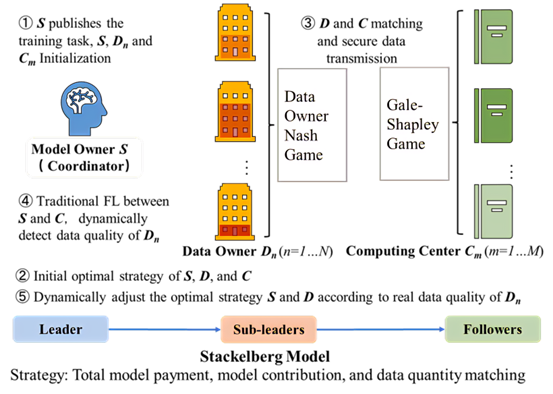

# QD-RDFL

<div align="center">

# Quality-aware Dynamic Resources-decoupled Federated Learning

[](https://www.python.org/)
[](https://pytorch.org/)
[](LICENSE)

</div>

## 📋 Overview

In this paper, we focus on **data assetization**, where data does not circulate but the information does. 

Our approach includes:

- A framework for **resource-decoupled FL** involving model owners, data owners, and computing centers
- A **Tripartite Stackelberg Model** with theoretical analysis of the Stackelberg-Nash equilibrium (SNE)
- The **Quality-aware Dynamic Resources-decoupled FL algorithm (QD-RDFL)**, which derives optimal strategies for all parties using backward induction
- A **dynamic optimization mechanism** that improves strategy profiles by evaluating data quality contributions

Our extensive experiments demonstrate that our method effectively encourages collaboration between the three parties involved, maximizing global utility and the value of data assets.

## 🖼️ Model Framework



## 🛠️ Requirements

```bash
torch==2.3.0
torchvision==0.18.1a0
scikit-learn==1.3.0
pandas==2.0.3
numpy==1.24.3
matplotlib==3.7.2
```

## 📂 Project Structure

```
.
│  .gitignore
│  LICENSE
│  README.md
│  requirements.txt
│  setup.py
│
├─data               # Data storage
│  ├─dataset         # MNIST, CIFAR10, CIFAR100 datasets
│  ├─imgs            # Result visualizations
│  ├─log             # Experiment logs
│  ├─model           # Trained models
│  └─saved           # Saved experimental results
│
└─src                # Source code
   └─qd_rdfl         # Main package
      │  __init__.py
      │  __main__.py
      │  global_variable.py
      │
      ├─algorithms   # Core algorithms
      │  │  __init__.py
      │  │  GaleShapley.py
      │  │  Stackelberg.py
      │
      ├─datasets     # Dataset loaders
      │  │  __init__.py  
      │  │  CIFAR100Dataset.py
      │  │  CIFAR10Dataset.py
      │  │  MNISTDataset.py
      │
      ├─experiments  # Experiment scripts
      │  │  __init__.py
      │  ├─ablation        # Ablation studies
      │  ├─comparison      # Method comparisons
      │  ├─parameter_analysis  # Parameter sensitivity analysis
      │  └─supplement      # Supplementary experiments
      │
      ├─models       # Model architectures
      │  │  __init__.py
      │  │  CIFAR100CNN.py
      │  │  CIFAR10CNN.py
      │  │  MNISTCNN.py
      │
      ├─plots        # Visualization scripts
      │  │  __init__.py
      │  ├─ablation
      │  ├─comparison
      │  ├─parameter_analysis
      │  └─supplement
      │
      ├─roles        # Participant role definitions
      │  │  __init__.py
      │  │  CPC.py         # Computing center
      │  │  DataOwner.py   # Data owner
      │  │  ModelOwner.py  # Model owner
      │
      └─utils        # Utility functions
         │  __init__.py
         │  UtilsCIFAR10.py
         │  UtilsCIFAR100.py
         │  UtilsMNIST.py
```

## 🚀 Running Experiments

### ⚙️ Ablation Studies
Each experiment takes approximately 30 minutes due to training requirements.

#### With Dynamic Adjustment
```bash
# MNIST with dynamic adjustment
python -m src.qd_rdfl.experiments.ablation.adjust.ablation-MNIST-adjust --adjustment_literation 2 

# CIFAR10 with dynamic adjustment
python -m src.qd_rdfl.experiments.ablation.adjust.ablation-CIFAR10-adjust --adjustment_literation 2 

# CIFAR100 with dynamic adjustment
python -m src.qd_rdfl.experiments.ablation.adjust.ablation-CIFAR100-adjust --adjustment_literation 2 
```

#### Without Dynamic Adjustment
```bash
# MNIST without dynamic adjustment
python -m src.qd_rdfl.experiments.ablation.noneadjust.ablation-MNIST-noneadjust --adjustment_literation 2 

# CIFAR10 without dynamic adjustment
python -m src.qd_rdfl.experiments.ablation.noneadjust.ablation-CIFAR10-noneadjust --adjustment_literation 2 

# CIFAR100 without dynamic adjustment
python -m src.qd_rdfl.experiments.ablation.noneadjust.ablation-CIFAR100-noneadjust --adjustment_literation 2 
```

### 📊 Comparison Experiments
Each comparison experiment takes about 30 minutes to run.

#### FIX Strategy
```bash
# MNIST with FIX strategy
python -m src.qd_rdfl.experiments.comparison.FIX.comparison-MNIST-FIX --adjustment_literation 2

# CIFAR10 with FIX strategy
python -m src.qd_rdfl.experiments.comparison.FIX.comparison-CIFAR10-FIX --adjustment_literation 2

# CIFAR100 with FIX strategy
python -m src.qd_rdfl.experiments.comparison.FIX.comparison-CIFAR100-FIX --adjustment_literation 2
```

#### MIX Strategy
```bash
# MNIST with MIX strategy
python -m src.qd_rdfl.experiments.comparison.MIX.comparison-MNIST-MIX --adjustment_literation 2

# CIFAR10 with MIX strategy
python -m src.qd_rdfl.experiments.comparison.MIX.comparison-CIFAR10-MIX --adjustment_literation 2

# CIFAR100 with MIX strategy
python -m src.qd_rdfl.experiments.comparison.MIX.comparison-CIFAR100-MIX --adjustment_literation 2
```

#### QD-RDFL (Our Method)
```bash
# MNIST with QD-RDFL
python -m src.qd_rdfl.experiments.comparison.QD-RDFL.comparison-MNIST --adjustment_literation 2

# CIFAR10 with QD-RDFL
python -m src.qd_rdfl.experiments.comparison.QD-RDFL.comparison-CIFAR10 --adjustment_literation 2

# CIFAR100 with QD-RDFL
python -m src.qd_rdfl.experiments.comparison.QD-RDFL.comparison-CIFAR100 --adjustment_literation 2
```

#### RANDOM Strategy
```bash
# MNIST with RANDOM strategy
python -m src.qd_rdfl.experiments.comparison.RANDOM.comparison-MNIST-RANDOM --adjustment_literation 2

# CIFAR10 with RANDOM strategy
python -m src.qd_rdfl.experiments.comparison.RANDOM.comparison-CIFAR10-RANDOM --adjustment_literation 2

# CIFAR100 with RANDOM strategy
python -m src.qd_rdfl.experiments.comparison.RANDOM.comparison-CIFAR100-RANDOM --adjustment_literation 2
```

### 📈 Parameter Analysis
Parameter analysis experiments run quickly (approximately 30 seconds each).

#### Alpha Parameter
Investigate changes in Us and average Un under different Alpha values:
```bash
python -m src.qd_rdfl.experiments.parameter_analysis.Alpha.parameter_analysis-MNIST-Alpha --adjustment_literation -1
python -m src.qd_rdfl.experiments.parameter_analysis.Alpha.parameter_analysis-CIFAR10-Alpha --adjustment_literation -1
python -m src.qd_rdfl.experiments.parameter_analysis.Alpha.parameter_analysis-CIFAR100-Alpha --adjustment_literation -1
```

#### Eta Parameter
Investigate changes in Us under different Eta values:
```bash
python -m src.qd_rdfl.experiments.parameter_analysis.Eta.parameter_analysis-MNIST-Eta --adjustment_literation -1
```

#### Sigma Parameter
Verify the impact of SigmaM changes on matching results:
```bash
python -m src.qd_rdfl.experiments.parameter_analysis.Sigma.parameter_analysis-MNIST-Sigma --adjustment_literation -1
python -m src.qd_rdfl.experiments.parameter_analysis.Sigma.parameter_analysis-CIFAR10-Sigma --adjustment_literation -1
python -m src.qd_rdfl.experiments.parameter_analysis.Sigma.parameter_analysis-CIFAR100-Sigma --adjustment_literation -1
```

#### xn Parameter
Investigate changes in average Un under different xn values:
```bash
python -m src.qd_rdfl.experiments.parameter_analysis.xn.parameter_analysis-MNIST-xn --adjustment_literation -1
```

### 📋 Supplementary Experiments

#### Accuracy Analysis
```bash
python -m src.qd_rdfl.experiments.supplement.accurancy.supplement-MNIST-accurancy --adjustment_literation -1
python -m src.qd_rdfl.experiments.supplement.accurancy.supplement-CIFAR10-accurancy --adjustment_literation -1
```

#### Un (Data Owner Utility) Analysis
```bash
python -m src.qd_rdfl.experiments.supplement.Un.supplement-MNIST-Un --adjustment_literation -1
python -m src.qd_rdfl.experiments.supplement.Un.supplement-CIFAR10-Un --adjustment_literation -1
```

#### Us (Model Owner Utility) Analysis
```bash
python -m src.qd_rdfl.experiments.supplement.Us.supplement-MNIST-Us --adjustment_literation -1
python -m src.qd_rdfl.experiments.supplement.Us.supplement-CIFAR10-Us --adjustment_literation -1
```

## 📊 Datasets

### Dataset Downloads

#### MNIST
- [Training images](https://storage.googleapis.com/cvdf-datasets/mnist/train-images-idx3-ubyte.gz)
- [Training labels](https://storage.googleapis.com/cvdf-datasets/mnist/train-labels-idx1-ubyte.gz)
- [Testing images](https://storage.googleapis.com/cvdf-datasets/mnist/t10k-images-idx3-ubyte.gz)
- [Testing labels](https://storage.googleapis.com/cvdf-datasets/mnist/t10k-labels-idx1-ubyte.gz)

#### CIFAR10
- [CIFAR-10 Python](https://www.cs.toronto.edu/~kriz/cifar-10-python.tar.gz)

#### CIFAR100
- [CIFAR-100 Python](https://www.cs.toronto.edu/~kriz/cifar-100-python.tar.gz)

### Dataset Setup Instructions

1. Download the dataset files from the links above
2. Extract each dataset to its designated directory:
   - MNIST: Extract to `data/dataset/MNIST/`
   - CIFAR10: Extract to `data/dataset/CIFAR10/`
   - CIFAR100: Extract to `data/dataset/CIFAR100/`

## 💡 Installation

You can install the package in development mode:

```bash
# Install package in development mode
pip install -e .
```

This allows you to modify the source code and have the changes take effect immediately without reinstalling.
